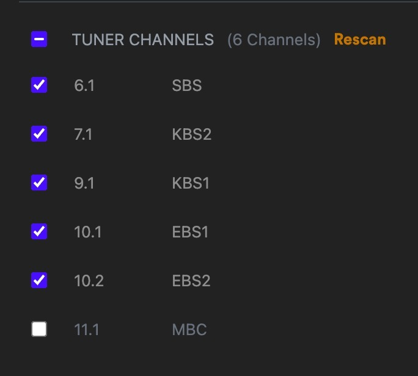

# Korean TV Channel LIST
TVXML file for Korean Terrestrial TV channels for use in PLEX server and HDHomerun.
As the Plex server does not allow to choose Korea as a country, this list can
at least make the channels visible and selectable.

The list contains the embedded logos of the channels

MBC
SBS
KBS1
KBS2
EBS1
EBS2

Feel free to share.
